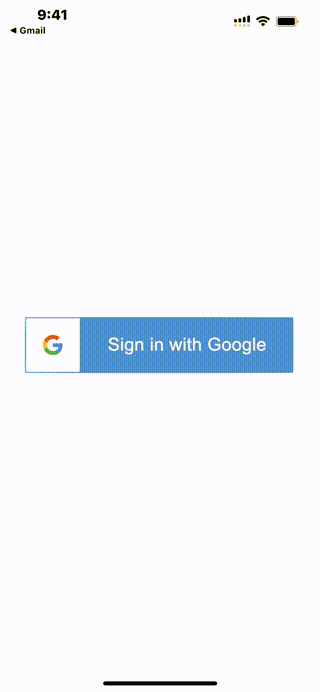

# WWSignInWith3rd+Google

[](https://developer.apple.com/swift/) [](https://developer.apple.com/swift/)  [](https://developer.apple.com/swift/) [](https://developer.apple.com/swift/)

[Use Google third-party login.](https://developers.google.com/identity/sign-in/ios/sign-in?hl=zh-tw)

[使用Google的第三方登入。](https://medium.com/彼得潘的-swift-ios-app-開發問題解答集/利用-firebase-實現-ios-app-的登入功能-cf1795ccec00)



### [Installation with Swift Package Manager](https://medium.com/彼得潘的-swift-ios-app-開發問題解答集/使用-spm-安裝第三方套件-xcode-11-新功能-2c4ffcf85b4b)
```js
dependencies: [
    .package(url: "https://github.com/William-Weng/WWSignInWith3rd_Google.git", .upToNextMajor(from: "1.0.0"))
]
```

### Example
```swift
import UIKit
import WWPrint
import WWSignInWith3rd_Apple
import WWSignInWith3rd_Google

final class ViewController: UIViewController {

    override func viewDidLoad() {
        super.viewDidLoad()
    }
    
    @IBAction func signInWithGoogle(_ sender: UIButton) {
        
        WWSignInWith3rd.Google.shared.login(withPresenting: self) { result in
            
            switch result {
            case .failure(let error): wwPrint(error)
            case .success(let info): wwPrint(info)
            }
        }
    }
}
```
